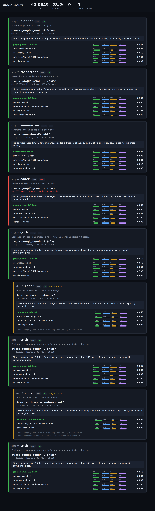

# model-route

**Agents say what a job needs. A router picks the model. Nothing is hardcoded, and no model ever picks a model.**

Most multi agent code glues a model to an agent, like `researcher = some_model`. That is a guess about a task you have not seen yet. This repo flips it. The agent declares what it needs, and about 150 lines of plain Python choose the model at call time, from the live catalog, by skill, price, context and speed. When a model flops or its work gets rejected, the router just picks again.



*That screenshot is a real replay of `runs/demo-run.jsonl`. You can watch it fill up yourself in about 30 seconds, no API key needed.*

## The whole idea in five lines

- Agents are roles. Models are resources. The router is the matchmaker.
- Skill scores live in one small YAML file. Prices and context windows come live from OpenRouter.
- Low stakes job? The cheapest capable model wins. High stakes? The strong one wins. Same code, different weights.
- A cheap model may label a task. Only Python picks a model, because models are biased about models.
- A rejected patch triggers a retry with that model banned. Choosing again after a failure is the whole point.

## Pick your path

### Beginner: see it run in 30 seconds (no key, no cost)

You need Python 3.11 or newer. That is it.

```bash
git clone https://github.com/JoyyCLangat/model-route
cd model-route
pip install -r requirements.txt
python main.py --replay runs/demo-run.jsonl
```

- Your terminal fills with the trace, one card per step.
- Want the pretty version? Open `http://127.0.0.1:8000` right after it starts. The run plays over about 20 seconds.
- Press `Ctrl+C` to quit. No key was used, and the whole run "cost" about 6 cents on paper.

What you just watched: five roles, three different models, one call that failed, and two retries that recovered. Prefer terminal only and a clean exit? Add `--no-panel`.

### Intermediate: run it for real on your own tasks

1. Get a key at https://openrouter.ai/keys. A dollar of credit lasts a long time.
2. Drop it in:
   ```bash
   cp .env.example .env
   # open .env, paste your key after OPENROUTER_API_KEY=
   ```
3. Point it at the bundled buggy project, or swap in your own folder:
   ```bash
   python main.py --goal "Audit this repo and propose a fix" --path ./sample_target
   ```
4. No credit, or just curious? Run on free models only, for zero dollars:
   ```bash
   FREE_MODE=true python main.py
   ```
5. Change the router's mind. Open `core/capabilities.yaml`, bump a family's `code` score, run again, and watch a different model win. That file is the only place a human opinion lives.

### Pro: bend it to your will

- **See the live catalog and prices** your key can reach:
  ```bash
  python core/catalog.py
  ```
- **Add an agent.** A whole role is four attributes and a prompt. No model anywhere:
  ```python
  from agents.base import Agent

  class Translator(Agent):
      name = "translator"
      required_capabilities = ["reasoning"]
      stakes = "low"
      system = "You translate faithfully and keep the formatting."
  ```
- **Add a model.** If it is in the OpenRouter catalog, the registry already sees it, with its live price and window. Give it a skill opinion with one row in `core/capabilities.yaml` under its family prefix. No row means neutral scores, and it is still eligible.
- **Replace the guesses with evidence.** The skill scores are hand set. Measure them:
  ```bash
  python bench/run.py          # one model per family, cheap
  python bench/run.py --all    # everything your key can reach
  ```
  Results land in [RESULTS.md](RESULTS.md), judged pairwise by a model from a different family, because self scoring is not honest.
- **Read the good part.** `core/router.py` is the whole brain, under 200 lines. Start there.
- **Walk the build.** Five git tags take you from a single call function to the finished demo:
  ```bash
  git checkout step-1-gateway   # then step-2-registry ... up to step-5-fallback
  ```
  Run `git tag` to list them. If your clone has none, they live in the branch history.
- **Prove models are not neutral about models:**
  ```bash
  python experiments/self_bias.py
  ```

## How the router picks (the one trick)

Two moves. First it throws out any model that cannot do the job: context too small, no vision when the task needs it, unhealthy after recent failures, not free during free mode, or banned by a retry. Then it scores whoever is left, from 0 to 1:

```
score =  w_cap   * capability     # good at the skills this task needs
       + w_cost  * cheapness      # the cheapest survivor gets a 1
       + w_speed * speed
       + w_ctx   * context_fit
```

The trick is that the weights move with the stakes:

| stakes | capability | cost | speed | context |
| --- | --- | --- | --- | --- |
| low | 0.30 | 0.45 | 0.15 | 0.10 |
| medium | 0.50 | 0.30 | 0.10 | 0.10 |
| high | 0.70 | 0.10 | 0.05 | 0.15 |

Cheap bulk job? Cost carries it, so the small model wins. Risky job? Capability carries it, so the strong model wins even though it costs more. Same models, same code, different row.

## What one run actually does

`main.py` sends one goal through five roles. Each role runs the same tiny loop: classify the task, add its own needs, ask the router, call the winner, mark its health, log the whole thing.

| step | role | stakes | what the router leans toward |
| --- | --- | --- | --- |
| 1 | planner | high | a capable model |
| 2 | researcher | medium | a big context model, since the input is large |
| 3 | summarizer | low | the cheapest model that can do it |
| 4 | coder | high | a capable model |
| 5 | critic | high | reviews the patch and can reject it |

Reject a patch and the coder runs again with that model banned, so the router is forced somewhere new. Here is that recovery straight from the recorded run:

```
step 3 summarizer -> moonshotai/kimi-k2         cheap wins the low stakes job
step 4 coder      -> google/gemini-2.5-flash    FAILED (503, a bad minute)
step 6 coder      -> moonshotai/kimi-k2         retry, gemini banned
step 8 coder      -> anthropic/claude-opus-4.1  retry, two models banned, escalate
```

That one call to the strongest model cost about twenty times the rest of the run combined. The router only reaches for it when the stakes are worth it, and you can argue with that by editing one table of weights.

## The honest small print

- The skill scores in `capabilities.yaml` are a human guess until you run `bench/run.py`. [RESULTS.md](RESULTS.md) says so plainly and has no invented numbers.
- Scores are keyed by family, so the router cannot tell a fast small model from a big one in the same family. Price and context break the tie.
- The classifier adds one cheap call. If it fails or returns junk, keyword rules take over and the run still finishes. You can literally pull the network cable.
- The bundled `runs/demo-run.jsonl` has real routing but representative costs, since it was recorded without live API access.
- Any "best model" list goes stale within weeks. That is why the scores are one small file and the benchmark is a script, not a paragraph frozen here.

## Costs

A full live run is a few cents, most of it the single high stakes call. Want zero? Use `FREE_MODE=true`, or `--replay`, which calls nothing at all.

## Talk and license

Slides and video: coming soon. Speaker: Langat. License: [MIT](LICENSE).
